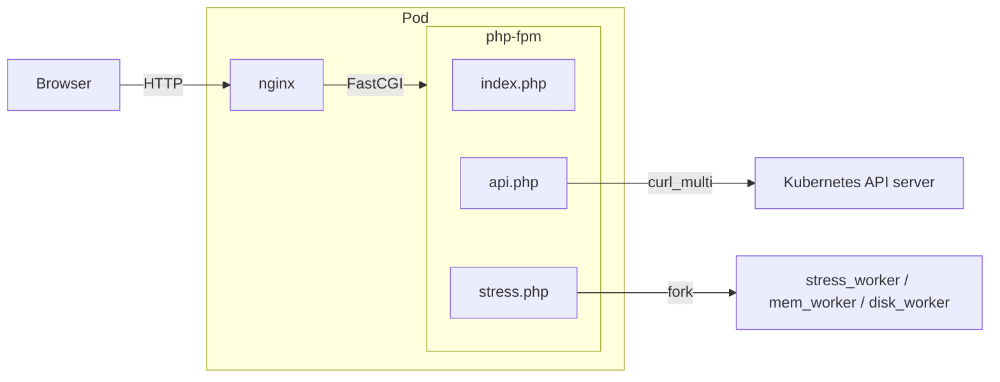

# Architecture

## Overview



All Kubernetes API calls are fired in parallel via `curl_multi` — one page load, one round-trip.

- `index.php` — server-side shell: reads Downward API env vars, renders layout + inline JS
- `api.php` — fires all K8s API calls in parallel, returns a single JSON blob
- `k8s.php` — curl_multi helpers, unit converters (`k8s_cpu_to_millicores`, `k8s_mem_to_mib`), formatters
- `stress.php` — stress test actions (`?action=start_cpu|start_mem|start_disk|stop|status`)
- `stress_worker.php` — background CPU burn process (launched by `stress.php`)
- `mem_worker.php` — background RAM allocation process
- `disk_worker.php` — background disk fill process
- JS in `index.php` polls `api.php` every 5 s; polls `stress.php` every 2 s during active tests, 5 s when idle

When `MEMCACHE_HOST` is set (via `hpaBench.enabled`), stress state is stored in Memcached so all replicas stay in sync. Otherwise falls back to `/tmp/stress_state.json` (single-replica only).

Workers check shared state at the **top** of each loop iteration before writing, so a stop signal written by `stress.php` is never overwritten by a lagging worker.

---

## Project layout

```
.
├── Dockerfile
├── entrypoint.sh              # Startup: launches nginx + php-fpm
├── nginx.conf
├── src/
│   ├── index.php              # Dashboard shell + inline JS
│   ├── api.php                # Kubernetes API aggregator (curl_multi)
│   ├── k8s.php                # Helpers: curl, unit converters, formatters
│   ├── stress.php             # Stress test orchestrator endpoint
│   ├── stress_worker.php      # Background CPU burn worker
│   ├── mem_worker.php         # Background RAM allocation worker
│   ├── disk_worker.php        # Background disk fill worker
│   └── assets/
│       ├── style.css
│       ├── parrot.gif         # Bundled (no CDN)
│       └── space-grotesk.woff2  # Bundled (no Google Fonts)
├── chart/
│   └── parrot-app/            # Helm chart (OCI-compatible)
│       └── templates/
│           ├── deployment.yaml
│           ├── service.yaml
│           ├── ingressroute.yaml   # Traefik IngressRoute + sticky sessions
│           ├── hpa.yaml            # HPA (hpaBench.enabled only)
│           ├── memcached.yaml      # Inline Memcached (hpaBench.enabled only)
│           └── ...
├── k8s/
│   └── test-scenarios/        # Reference RBAC manifests
│       ├── scenario-3-reader-sa.yaml   # Full read SA (recommended for demo)
│       └── ...
└── screenshots/               # Dashboard screenshots for documentation
```
