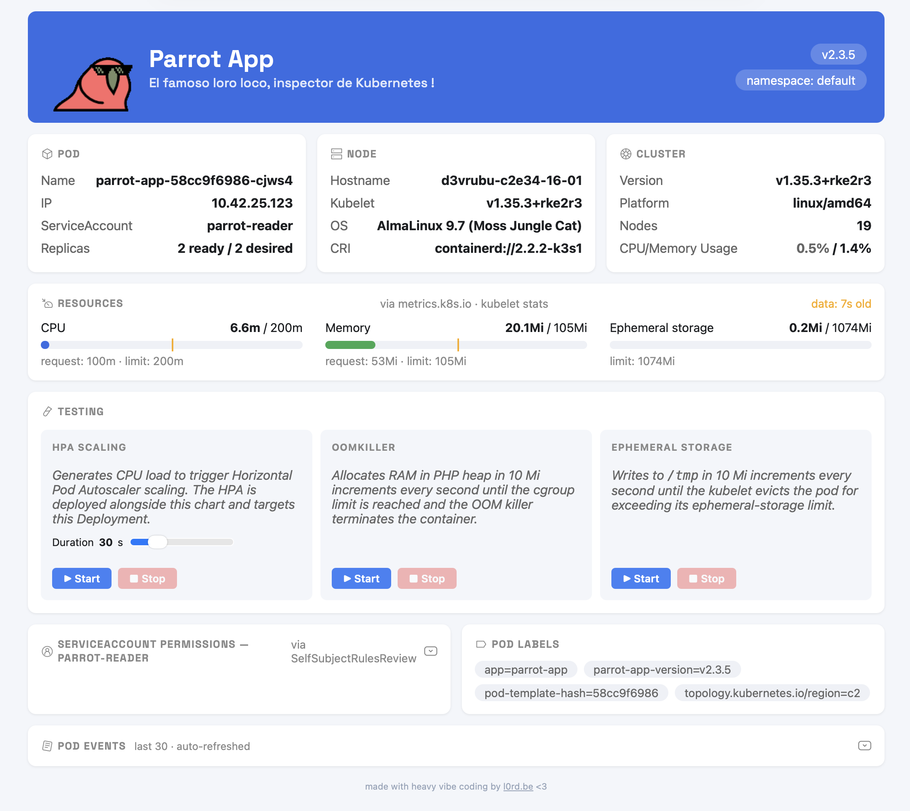

# Parrot App

<p align="center">
  
</p>

<p align="center"><strong>El famoso loro loco, inspector de Kubernetes!</strong></p>

<p align="center">
A lightweight PHP dashboard that runs <strong>inside</strong> your cluster and shows what your pod can actually see: resources, permissions, node info, live metrics, and events. Drop it in, assign a ServiceAccount, and instantly visualise the cluster from the pod's own perspective.
<br><br>
Built as a hands-on teaching tool for Kubernetes concepts: RBAC, resource limits, HPA, OOMKiller, ephemeral storage eviction. No heavy frameworks. No external dependencies.
</p>

**TL;DR** — install with Helm and set your hostname:

```bash
helm upgrade --install parrot-app oci://ghcr.io/cyberbugjr/charts/parrot-app \
  --version 0.5.8 \
  --namespace default \
  --set ingress.host=parrot.example.com
```

---

## What it shows

| Section | What you get |
|---------|-------------|
| **Pod** | Name, IP, ServiceAccount, replica count — always from the pod that served the request (split-brain safe) |
| **Node** | Hostname, kubelet version, OS image, container runtime of the node hosting this pod |
| **Cluster** | Kubernetes version, platform, node count, CPU and Memory usage as % of total cluster capacity |
| **Resources** | Live CPU/memory/ephemeral-storage gauges via `metrics.k8s.io` with request/limit markers and metrics age indicator |
| **Testing** | CPU burn (HPA trigger), RAM saturation (OOMKiller), disk fill (ephemeral eviction) — with live status |
| **ServiceAccount Permissions** | Collapsible section: `SelfSubjectRulesReview` dump + `nodes:list` cluster-wide probe. Hidden when running as the `default` SA. |
| **Pod Labels** | All labels injected via the Downward API |
| **Pod Events** | Collapsible section showing the last 30 events for the current pod, auto-refreshed |

---



---

## Requirements

- Kubernetes 1.24+
- Traefik v2+ (for `IngressRoute`) — or disable `ingress.enabled` and use your own ingress
- `metrics-server` installed for live CPU/memory gauges and cluster usage % (degrades gracefully if absent)
- PHP 8.4, nginx (included in the image)
- Memcached (only when `hpaBench.enabled=true` — deployed inline by the chart)

---

## Quick start

### Helm (recommended)

```bash
helm upgrade --install parrot-app oci://ghcr.io/cyberbugjr/charts/parrot-app \
  --version 0.5.8 \
  --namespace default \
  --set ingress.host=parrot.example.com
```

For all available options see [`chart/parrot-app/values.yaml`](chart/parrot-app/values.yaml).

### Plain manifests

```bash
kubectl apply -f k8s/
```

---

## RBAC test scenarios

The chart does **not** create RBAC resources — bring your own ServiceAccount and ClusterRole/RoleBinding. Three reference scenarios are provided in [`k8s/test-scenarios/`](k8s/test-scenarios/):

| Scenario | ServiceAccount | What it tests |
|----------|---------------|---------------|
| `default` | namespace default | No K8s API access — all sections show 403 |
| `scenario-2-bare-sa.yaml` | `parrot-bare` | Token present, no RBAC rules |
| `scenario-3-reader-sa.yaml` | `parrot-reader` | Nodes, namespaces, metrics — full dashboard |

Apply a scenario, then set `serviceAccountName` in the Helm release to match.

The `parrot-reader` scenario requires a `ClusterRole` for node access and `metrics.k8s.io` (pods + nodes). See the manifest for the full RBAC breakdown.

---

## Stress testers

All three testers share state via Memcached (when `hpaBench.enabled=true`) or a `/tmp` JSON file (single-replica fallback). This ensures the Stop button works regardless of which replica serves the stop request.

### HPA Scaling Test (`hpaBench.enabled=true`)

Generates a configurable CPU burn loop (background PHP process) to trigger a pre-configured HPA. Duration is adjustable via a slider (10 s to 120 s). Requires `hpaBench.enabled=true` — this also deploys an in-chart Memcached pod so all replicas share running test state. The HPA itself is not managed by this chart.

### OOMKiller Test

Allocates RAM directly in the PHP heap using `str_repeat` in 10 Mi increments every second until the cgroup memory limit is reached and the OOM killer terminates the container. Shows a warning banner if no memory limit is configured (risk of node-wide OOM pressure). Always visible.

### Ephemeral Storage Test

Writes to `/tmp` in 10 Mi increments every second until the kubelet evicts the pod for exceeding its ephemeral-storage limit. Non-null bytes (`\xff`) are used to prevent sparse-file optimisation on overlay2. Shows a warning if no ephemeral-storage limit is configured. Always visible.

---

## Building

```bash
# Build for amd64 (Kubernetes nodes)
podman build --platform linux/amd64 -t parrot-app:dev .

# Run locally (no K8s API available — gauges fall back to local PHP measurement)
podman run --rm -p 8080:8080 parrot-app:dev
```

The image is based on `php:8.4-fpm-alpine` + nginx. No root process at runtime.

---

See [ARCHITECTURE.md](ARCHITECTURE.md) for internal design and project layout.

Contributing guidelines are in [CONTRIBUTING.md](CONTRIBUTING.md).
